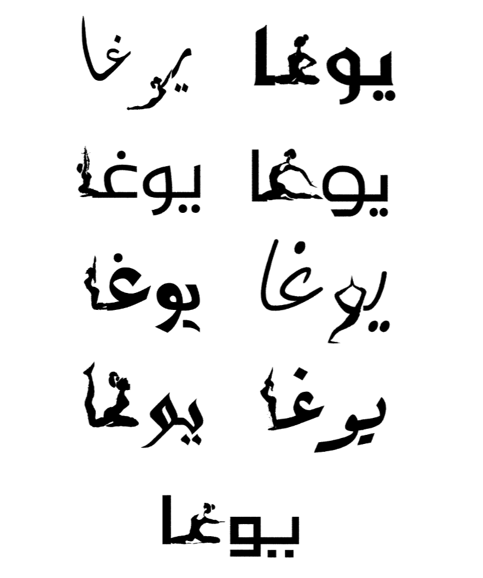
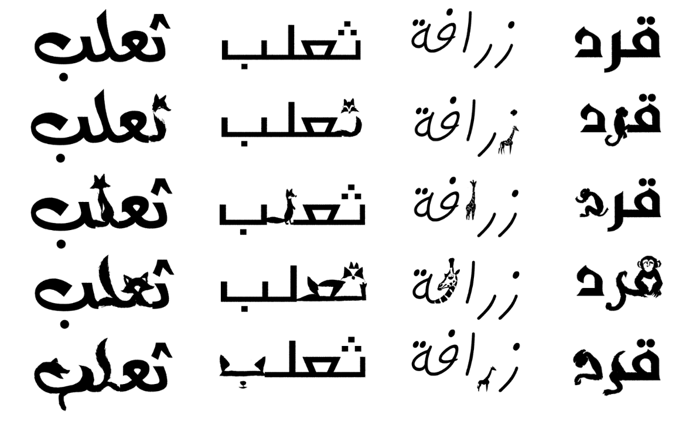
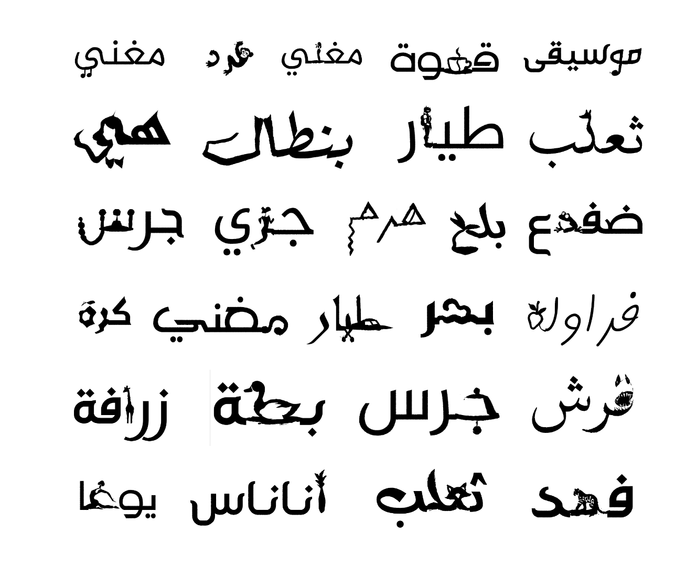
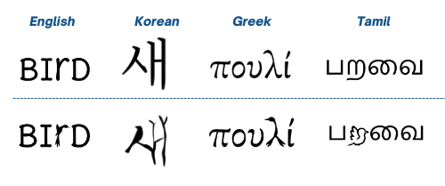

# Letters Canvas: Diffusion-guided Vector Arabic Semantic Typography

<br>
<div align="center"></div>
<br>

This project builds on the [Font-To-Sketch: Morphing Any Font to a Visual Representation](https://github.com/BKHMSI/Font-To-Sketch) and [Word-As-Image for Semantic Typography](https://wordasimage.github.io/Word-As-Image-Page/) work to support Arabic words' simultaneous multi-letter morphing into a visual representation of a semantic concept while preserving word legibility.


## Setup

1. Clone the repo:
```bash
git clone https://github.com/WordAsImage/Word-As-Image.git (TO-DO: chnage link)
cd Word-As-Image
```
2. Create a new conda environment and install the libraries:
```bash
conda create --name word python=3.8.15
conda activate word
bash requirements.sh
```
3. Paste your HuggingFace [access token](https://huggingface.co/settings/tokens) for StableDiffusion in the TOKEN file.
## Run Experiments 
```bash
conda activate word
cd Word-As-Image

# Please modify the parameters accordingly in the file and run:
bash run.sh
```
## Examples

The first GIF you can see above is for multiple Arabic words showing the morphing process.

The next image shows the word “YOGA” in Arabic, using nine different fonts.
<br>
<div align="center"></div>
<br>

More results for animal names written in Arabic in different fonts, namely 'fox', 'giraffe', 'monkey', from left to right:

<br>
<div align="center"></div>
<br>
More results:

<br>
<div align="center"></div>
<br>

The demo currently also supports other languages as well as shown in the next image.

<br>
<div align="center"></div>
<br>

