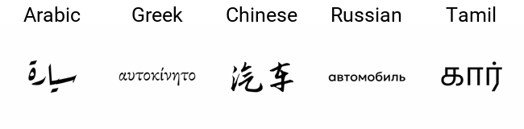
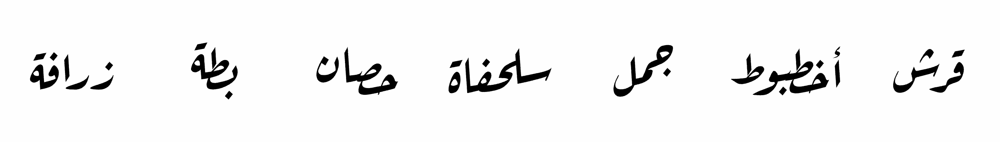

# Font-To-Sketch: Morphing Any Font to a Visual Representation

 

 

This project builds on the [Word-As-Image for Semantic Typography](https://wordasimage.github.io/Word-As-Image-Page/) work to support **any** font and morphing whole words into a visual representation of a semantic concept. It is part of an ongoing project with the [ARBML](https://arbml.github.io/website/) community to build open-source Arabic tools using machine learning.

The demo currently supports the following scripts: **Arabic**, **Simplified Chinese**, **Cyrillic**, **Greek**, **Latin**, **Tamil**. Therefore you can write the text in any language using those scripts. To add support for more fonts please check below.

## Contributing to Font Support

Thank you for your interest in expanding the font collection! To support additional fonts, please follow these steps:

1. Navigate to the `code/data/fonts` directory.
2. Locate the folder corresponding to the script name you wish to add a font for. If the script is not currently supported, create a new folder with the script name.
3. Add the desired `.ttf` font file to the appropriate folder.
4. Please ensure the font file is less than 1MB in size.
5. Retain the original font name when adding the file.

For browsing and downloading open-source fonts, we recommend visiting [Google Fonts](https://fonts.google.com).

Thank you for your contributions in advancing our font selection!

## Examples

The first GIF you see above morphs the word 'car' in 5 languages into a sketch of a car. 

The second GIF contains 7 outputs of the program when given the Arabic name of an animal in text and asked to morph it into a visual representation of the actual animal. The input of course can be any text and the output any concept.

For more examples please see the files under `./images`

## Todos
- [ ] Pass the initial generated font image through the Encoder
- [ ] Calculate the similarity between the initial generated font image and the generated image
- [ ] Use the similarity as a loss function to improve the generated image